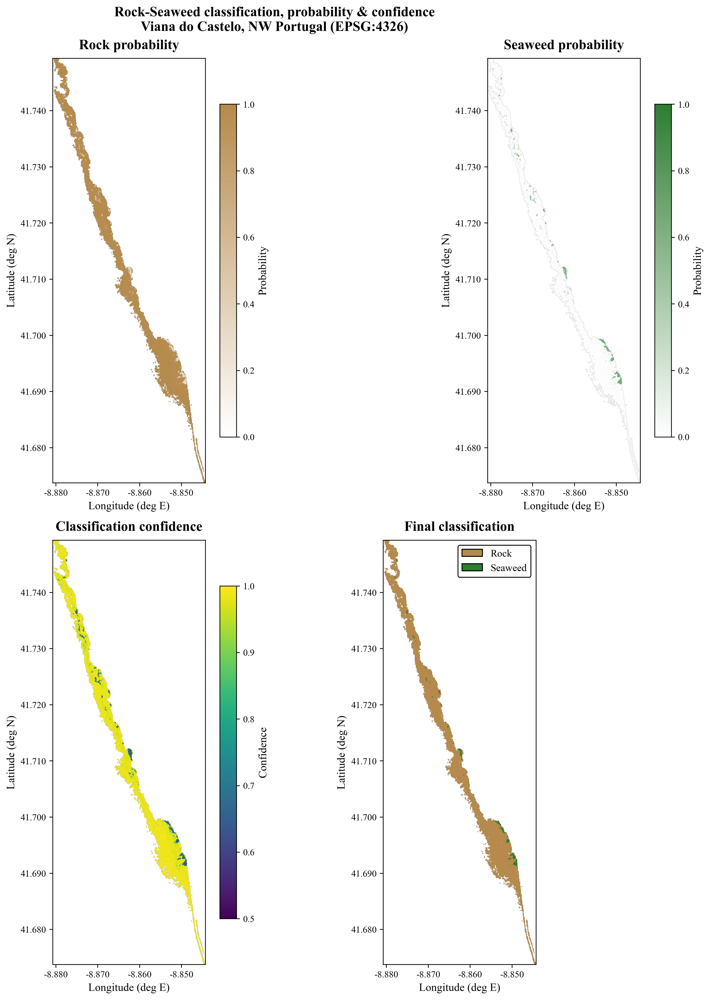

# Viana do Castelo — Intertidal Rock vs Seaweed Classification

Supervised (Random Forest) classification of an intertidal **Sentinel‑2 low‑tide
composite** into **Rock** and **Seaweed**, for the coast of Viana do Castelo,
NW Portugal. The workflow produces per‑class probability maps, a classification
confidence map, georeferenced GeoTIFF products, per‑class area statistics, and
publication‑quality figures (including satellite‑basemap overlays).

<p align="center">
  
</p>

---

## Results

| Class | Area (ha) | Cover | Test precision | Test recall |
|-------|-----------|-------|----------------|-------------|
| Rock (0)    | 175.4 | 97.3 % | 0.97 | 0.95 |
| Seaweed (1) |   4.9 |  2.7 % | 0.91 | 0.95 |

**Model:** Random Forest (100 trees, `max_depth=15`, `class_weight="balanced"`),
13 spectral/index features, 75/25 stratified train/test split.
**Overall accuracy 0.95 · Cohen’s κ 0.89.** Most important features: NDVI, NDWI, B3.

---

## Repository structure

```
viana_de_castelo_seaweed_classification/
├── viana_de_castelo.ipynb        # main pipeline: data → RF → maps → areas
├── map_visualisations.ipynb      # satellite-basemap maps + zoom (contextily)
├── data_used/                    # all inputs (self-contained)
│   ├── Lowtide_re.tif            # 13-band Sentinel-2 low-tide composite (EPSG:4326)
│   ├── training_points_scaled_with_coords1.csv   # 847 labelled samples
│   └── pol_carreco_viana_2017.*  # study-area shapefile (+ sidecars)
├── figures/                      # all generated outputs
│   ├── Model_Evaluation.png
│   ├── Class_Area.png
│   ├── class_area_summary.csv
│   ├── Classification_Map_Basemap.png / _ZOOM.png
│   └── georeferenced_maps/       # PNG + GeoTIFF per product + METADATA.txt
└── requirements.txt
```

---

## Method

1. **Training data** — 847 points with 13 features (`B1–B9, B8A, NDVI, NDWI, NDMI`)
   and a `class` label (0 = Rock, 1 = Seaweed).
2. **Model** — features standardised (`StandardScaler`), Random Forest trained on a
   stratified 75 % split; accuracy, Cohen’s κ, confusion matrix and feature
   importance reported on the held‑out 25 %.
3. **Classification** — every valid pixel of the 13‑band raster is classified;
   class, per‑class probability and confidence (max class probability) maps are
   reconstructed.
4. **Products** — georeferenced PNGs + GeoTIFFs (EPSG:4326), a 2×2 comparison panel,
   and per‑class areas computed after reprojection to **UTM 29N (EPSG:32629)** so
   areas are metric.
5. **Basemap maps** — `map_visualisations.ipynb` overlays the classification, the
   study‑area boundary and field/validation points on ESRI World Imagery
   (Web Mercator), plus a zoomed detail of the southern beds.

---

## How to run

```bash
# from this folder
pip install -r requirements.txt
jupyter lab            # or: jupyter notebook
```

Open and run **`viana_de_castelo.ipynb`** top‑to‑bottom first (it creates
`figures/georeferenced_maps/Final_Classification.tif`), then run
**`map_visualisations.ipynb`** for the basemap maps.

> Paths are **relative** to this folder — launch Jupyter from here so
> `data_used/` and `figures/` resolve correctly. `map_visualisations.ipynb`
> downloads basemap tiles and needs an internet connection.

---

## Data & coordinate systems

- Input raster and georeferenced products: **EPSG:4326** (WGS 84).
- Area computation: reprojected to **EPSG:32629** (UTM 29N).
- Basemap maps: **EPSG:3857** (Web Mercator, required by the tile provider).

## License

Released under the [MIT License](../LICENSE).

## Acknowledgements

Developed for **BioEcoOcean** / **AIR Centre**. Basemap imagery © Esri World Imagery.
